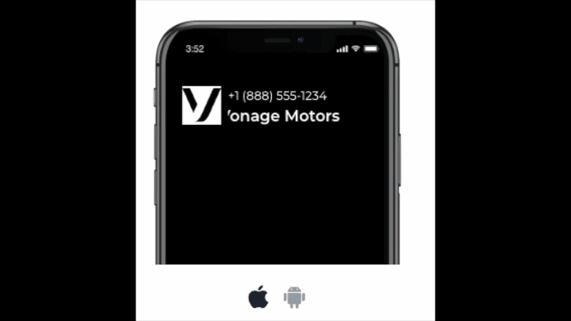

# Vonage Voice Branded Calling Demo (Node.js)



A minimal Node.js + Express demo app that places a single outbound **Vonage Voice API** call and serves the required **Answer** and **Event** webhooks. It’s designed to run locally (exposed via **ngrok**) and be triggered from a simple `curl` request.

This repo is intended to accompany the blog post on **Branded Calling with First Orion + Vonage**.

## Features

- **Outbound call trigger endpoint** (`POST /call`)
- **Answer webhook** that returns an NCCO `talk` action (`GET /answer`)
- **Event webhook** for call lifecycle callbacks (`POST /event`)
- **Branding via environment variables** (`COMPANY_NAME`, `GREETING`)
- **ngrok-friendly** via `PUBLIC_BASE_URL`

## Getting started

### 1) Prerequisites

- Node.js 18+
- ngrok
- A Vonage **Voice Application** (Application ID)
- A Vonage phone number enabled for Voice (and configured for Branded Calling in your account)
- A downloaded application private key (`private.key`)

### 2) Configure environment variables

Copy `.env.example` to `.env` and populate the following variables:

```ini
# Vonage auth (JWT via application)
VONAGE_APPLICATION_ID=your-app-id
VONAGE_PRIVATE_KEY_PATH=./private.key

# Call configuration
FROM_NUMBER=+12025550123
TO_NUMBER=+12025550124

# Branding (text-to-speech)
COMPANY_NAME=Acme Co
GREETING=We are calling to confirm your appointment.

# Local server
PORT=3000

# Public base URL (ngrok HTTPS URL)
PUBLIC_BASE_URL=https://xxxx.ngrok-free.app
```

Notes:

- `FROM_NUMBER` must be in **E.164** format and should be the Vonage number you’ve enabled for branded calling.
- `PUBLIC_BASE_URL` must be your **current ngrok HTTPS forwarding URL**. If you restart ngrok, you’ll need to update this value.
- Keep `private.key` **local** (do not commit it).

### 3) Install dependencies

```bash
npm install
```

### 4) Run the local server

```bash
npm run start
```

### 5) Expose the server to the internet with ngrok

In a separate terminal:

```bash
ngrok http 3000
```

Copy the **Forwarding HTTPS URL** and set it as `PUBLIC_BASE_URL` in `.env`, then restart your server.

## Usage

### Place a call (default `TO_NUMBER`)

```bash
curl -X POST http://localhost:3000/call \
  -H 'Content-Type: application/json' \
  -d '{}'
```

### Place a call (override destination per request)

```bash
curl -X POST http://localhost:3000/call \
  -H 'Content-Type: application/json' \
  -d '{"to":"+14155550100"}'
```

When the callee answers:

- Vonage requests `GET {PUBLIC_BASE_URL}/answer` to fetch call instructions (NCCO)
- The app responds with a `talk` action that reads your `COMPANY_NAME` + `GREETING`
- Vonage posts call status events to `POST {PUBLIC_BASE_URL}/event`

## Webhooks

- **Answer URL:** `GET {PUBLIC_BASE_URL}/answer`
- **Event URL:** `POST {PUBLIC_BASE_URL}/event`

These URLs are passed to Vonage dynamically when you trigger `POST /call`.

## Troubleshooting

### Branded call isn’t showing branding

- Confirm the `FROM_NUMBER` is the number assigned to your First Orion program and enabled in the Vonage dashboard branded calling settings.
- Branding display depends on carrier and device behavior. Test on multiple devices/carriers if possible.

### Vonage can’t reach my webhooks

- Confirm ngrok is running and `PUBLIC_BASE_URL` matches the current ngrok HTTPS URL.
- Verify the `/answer` endpoint is reachable:

```bash
curl -i https://your-ngrok-url/answer
```

### Call fails immediately or returns a Vonage auth error

- Double-check:
  - `VONAGE_APPLICATION_ID`
  - `VONAGE_PRIVATE_KEY_PATH` points to the correct key
  - `FROM_NUMBER` is a Vonage Voice-capable number in E.164

## Architecture

**Call flow:**

1. You run `curl` → `POST /call`
2. App creates an outbound call via Vonage Voice API with `answer_url` + `event_url`
3. Vonage requests `GET /answer` → app returns NCCO
4. Vonage posts call lifecycle updates to `POST /event`
